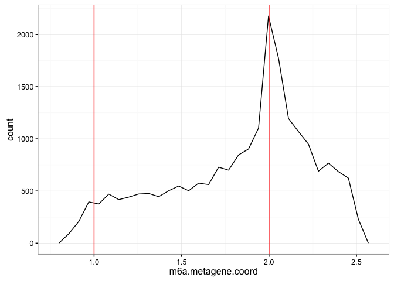
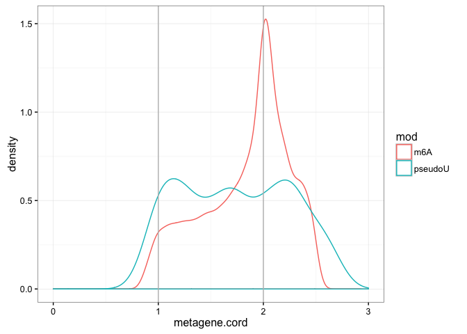

### Summary

MetaPlotR is a Perl/R pipeline for creating metagene plots. A metagene is a density plot or histogram of sites of interest (e.g. protein binding sites or RNA modifications) along a simplified transcript model containing a 5’UTR, coding sequence and 3’UTR.

### Requirements

1.  Unix/Linux based operating system (tested with Debian 7.8 and OS X 10.10.5)
2.  Perl (tested with version 5.22.2)
3.  R (tested with version 3.2.2); "scales" and "ggplot2" packages
4.  Bedtools (tested with version 2.22.1)

### Prepare primary data

#### Create query bed file

A six-column BED file (i.e. BED6) is required (see [here](https://genome.ucsc.edu/FAQ/FAQformat#format1) for specifications -- Note: columns 4 and 5 can be arbitrary). This tutorial uses a BED file of N6-methyladenosine (m6A) sites generated from Linder *et al.* Nat. Methods, 2015 (m6a.sorted.bed) and one of pseudouridine sites (pseudoU) genrated from Schraga *et al.* Cell, 2014 (pseudoU.sorted.bed). The sample BED files are located in the Github repository along with the MetaPlotR scripts. This files were sorted using the Unix sort command:

`sort –k1,1 –k2,2n m6a.bed > m6a.sorted.bed`

`sort –k1,1 –k2,2n pseudoU.bed > pseudoU.sorted.bed`

NOTE: MetaPlotR expects a bed file with 0-based single nucleotide coordinates.

#### Download genome and annotation file

Download genome of interest from the UCSC genome browser download page (<http://hgdownload.soe.ucsc.edu/downloads.html>). Here we use the hg19 human genome located here (<http://hgdownload.soe.ucsc.edu/goldenPath/hg19/bigZips/chromFa.tar.gz>).

Next, download the extended gene prediction tables from the UCSC Table Browser (<http://genome.ucsc.edu/cgi-bin/hgTables>). The figure below shows the necessary drop-down options to download the gencode gene annotations for the hg19 human genome.


#### Pre-process data

1.  **make\_annot\_bed.pl** creates a master annotation file (bed format) of every nucleotide in the transcriptome. The script is supplied with the locations of the genome directory (chroms/) and the gene prediction table (hg19\_gencode.genePred): `perl make_annot_bed.pl --genomeDir chroms/ --genePred hg19_gencode.genePred > hg19_annot.bed`

-   Sort the master annotation file using the unix sort command:
    `sort –k1,1 –k2,2n hg19_annot.bed > hg19_annot.sorted.bed`

2.  **size\_of\_cds\_utrs.pl** creates a file cataloging the transcriptomic coordinates of the start and end sites of the transcript regions (i.e. 5’UTR, CDS and 3’UTR). It takes the sorted master annotation file as input (*hg19\_annot.sorted.bed*) and outputs a region annotation file. The region annotation file is necessary for determining the distance of queried sites from the transcriptomic features (i.e. transcriptional start site, start codon, stop codon and transcript end).
    `perl size_of_cds_utrs.pl --annot hg19_annot.sorted.bed > region_sizes.txt`

3.  **annotate\_bed\_file.pl** annotates the user supplied BED file (demonstrated with *m6a.sorted.bed*) containing single nucleotide genomic coordinates of sites of interest. It serves as a wrapper for Bedtools Intersect and essentially labels every line in the user supplied BED file with the matching line (i.e. same coordinates) in the master annotation file (*hg19\_annot.sorted.bed*). The outputted file is called the annotated query file.
    `perl annotate_bed_file.pl --bed m6a.sorted.bed --bed2 hg19_annot.sorted.bed > annot_m6a.sorted.bed`

-   Alternatively, Bedtools intersect can be evoked directly using the command: `intersectBed -a m6a.sorted.bed -b hg19_annot.sorted.bed -sorted -wo –s > annot_m6a.sorted.bed`

4.  **rel\_and\_abs\_dist\_calc.pl** identifies the region of the transcript in which the user supplied sites fall and converts the transcriptomic coordinates to metagene coordinates. Namely, sites that occur in the 5’UTR have a value from 0 to 1, where 0 and 1 represent the 5’ and 3’ ends of the 5’UTR, respectively. Similarly, sites in the CDS have a value from 1 to 2 and the 3’UTR 2 to 3. The script takes as input the annotated query file *annot\_miclip.cims.bed* and the region annotation file *utr\_cds\_ends.txt*. The outputted distance measure file contains all the values needed to plot the metagenes. `perl rel_and_abs_dist_calc.pl --bed annot_m6a.sorted.bed --regions region_sizes.txt > m6a.dist.measures.txt`

### Understanding the distance measure file

All proceeding code are in R (<https://www.r-project.org/>). We recommend working with R using RStudio (<https://www.rstudio.com/>).
The input for this section is the metagene coordinates file outputted from **rel\_and\_abs\_dist\_calc.pl** (available on Github)

Read in distance measure file for m6A

``` r
m6a.dist <- read.delim ("m6a.dist.measures.txt", header = T)
```

View the number of rows and columns in the dataset

``` r
dim(m6a.dist)
```

    ## [1] 20903    14

View the first few lines

``` r
head(m6a.dist)
```

    ##    chr  coord gene_name          refseqID rel_location utr5_st utr5_end
    ## 1 chr1 878151    SAMD11 ENST00000342066.3     1.624145    1359     1277
    ## 2 chr1 879955     NOC2L ENST00000327044.6     2.242857    2418     2369
    ## 3 chr1 934375      HES4 ENST00000304952.6     2.673684     867      730
    ## 4 chr1 934375      HES4 ENST00000428771.2     2.659794    1006      808
    ## 5 chr1 934375      HES4 ENST00000484667.2     2.719101     641      634
    ## 6 chr1 934423      HES4 ENST00000304952.6     2.168421     819      682
    ##   cds_st cds_end utr3_st utr3_end utr5_size cds_size utr3_size
    ## 1   1276    -769    -770    -1191        82     2045       421
    ## 2   2368     119     118     -371        49     2249       489
    ## 3    729      64      63      -31       137      665        94
    ## 4    807      64      63      -33       198      743        96
    ## 5    633      64      63      -25         7      569        88
    ## 6    681      16      15      -79       137      665        94

This input file contains 20903 rows and 14 columns. Each row represents a single site (in this example an m6A site). The column headers for the first four columns are self explanatory. The fifth column "rel\_location" (for relative location) contains the calculated metagene coordinates. In its simplest form (i.e. non-normalized), the metagene coordinates from 0 to 1 represent the 5'UTR with 0 being closer to the beginning of the 5'UTR and 1 closer to the end. Similarly, 1 to 2 represents the CDS and 2 to 3 the 3'UTR. A histogram/density plot of the "rel\_location" value gives the standard metagene.

In addition to the standard metagene which is based on the relative location of sites in transcripts, this next six columns (utr5\_st, utr5\_end, cds\_st, cds\_end, utr3\_st, utr3\_end) contain information for plotting the absolute distance of sites from several points of interest. For example, in this dataset the third row has a value of +63 under column header "utr3\_st". That means the site is 63 nucleotides upstream of the 3'UTR start site.

The last three columns contain the lengths of the 5'UTRs, coding sequences and 3'UTRs.

### Selecting gene isoforms for metagene analysis

The dataset is redundant -- a given site is represented by multiple transcript isoforms. The choice of which isoforms to choose should be informed by the underlying biology. For example, if a gene expression dataset is available, one option may be to pick the highest expressed isoform. Another option is to pick the longest isoform, which is likely to capture more sites. Below is sample code for picking the longest isoforms

``` r
# Determine longest length transcript for each gene
trx_len <- m6a.dist$utr5_size + m6a.dist$cds_size + m6a.dist$utr3_size # Determine transcript length
temp <- data.frame(m6a.dist$gene_name, m6a.dist$refseqID, trx_len)
colnames(temp) <- c("gene_name", "gid", "trx_len") 
temp.df <- temp[order(temp$gene_name, temp$gid, -temp$trx_len),]
temp.df <- temp[!duplicated(temp$gene_name),]

# limit m6a data to one transcript per gene (longest)
m6a <- m6a.dist[m6a.dist$refseqID %in% temp.df$gid,]

# View size of our dataset (rows, columns)
dim(m6a.dist)
```

    ## [1] 20903    14

### Visualizing the metagene

#### A simple histogram

``` r
library (ggplot2)
```

    ## Warning: package 'ggplot2' was built under R version 3.1.3

``` r
qplot(m6a.dist$rel_location, geom="histogram") + geom_vline(xintercept = 1:2, col = "grey") + theme_bw()
```

    ## `stat_bin()` using `bins = 30`. Pick better value with `binwidth`.


In this plot, the range 0 to 1 represents the 5'UTR, 1 to 2 the CDS, and 2 to 3 the 3'UTR (as delineated by the red vertical lines). From this figure, one may conclude that the events (in this case m6A sites) occur througout the gene body with a peak around the stop codon and a precipitous transition from the 5'UTR to the CDS. However, one caveat is that the three regions of interest are drawn with equal widths. On average, this is not the case. We can view the average lenghts in this dataset:

``` r
summary(data.frame(m6a.dist$utr5_size, m6a.dist$cds_size, m6a.dist$utr3_size))
```

    ##  m6a.dist.utr5_size m6a.dist.cds_size m6a.dist.utr3_size
    ##  Min.   :    0.0    Min.   :   38     Min.   :    0     
    ##  1st Qu.:   94.0    1st Qu.:  794     1st Qu.:  308     
    ##  Median :  195.0    Median : 1394     Median :  718     
    ##  Mean   :  275.7    Mean   : 1865     Mean   : 1173     
    ##  3rd Qu.:  347.0    3rd Qu.: 2318     3rd Qu.: 1541     
    ##  Max.   :14959.0    Max.   :26393     Max.   :17331

The median lengths are 195, 1394, and 718 for the 5'UTR, CDS and 3'UTR, respectively.

To account for these length differences in the metagene, we can re-scale the widths of the 5'UTR and 3'UTR relative to the CDS (which is set constant to a width of 1 unit). So first we calculate a simple scale factor (SF):

``` r
utr5.SF <- median(m6a.dist$utr5_size, na.rm = T)/median(m6a.dist$cds_size, na.rm = T)
utr3.SF <- median(m6a.dist$utr3_size, na.rm = T)/median(m6a.dist$cds_size, na.rm = T)
```

The SF for the 5'UTR is 0.14 and for the 3'UTR is 0.52. Next, the following code rescales these regions accordingly:

``` r
# assign the regions to new dataframes
utr5.m6a.dist <- m6a.dist[m6a.dist$rel_location < 1, ]
cds.m6a.dist <- m6a.dist [m6a.dist$rel_location < 2 & m6a.dist$rel_location >= 1, ]
utr3.m6a.dist <- m6a.dist[m6a.dist$rel_location >= 2, ]

# rescale 5'UTR and 3'UTR
library("scales")
```

    ## Warning: package 'scales' was built under R version 3.1.3

``` r
utr5.m6a.dist$rel_location <- rescale(utr5.m6a.dist$rel_location, to = c(1-utr5.SF, 1), from = c(0,1))
utr3.m6a.dist$rel_location <- rescale(utr3.m6a.dist$rel_location, to = c(2, 2+utr3.SF), from = c(2,3))
```

Finally, plot the metagene with the rescaled UTRs

``` r
# Combine and plot
## Histogram
m6a.metagene.coord <- c(utr5.m6a.dist$rel_location, cds.m6a.dist$rel_location, utr3.m6a.dist$rel_location)
p <- qplot(m6a.metagene.coord, geom="histogram") + geom_vline(xintercept = 1:2, col = "grey") + theme_bw()
```

### Alternate representations of the metagene

#### A frequency polygon

``` r
qplot(m6a.metagene.coord, geom="freqpoly") + geom_vline(xintercept = 1:2, col = "red") + theme_bw()
```

    ## `stat_bin()` using `bins = 30`. Pick better value with `binwidth`.



#### A smooth density plot

``` r
qplot(m6a.metagene.coord, geom="density") + geom_vline(xintercept = 1:2, col = "red") + theme_bw()
```


### Comparing multiple metagene plots

It is often desireable to compare two or more metagene plots. These plots can represent different experimental conditions (e.g. control vs treatment) or even different groups within the same dataset (e.g. highly vs lowly expressed genes). Below we demonstrate a comparsion of the metagene for m6A to that of pseudouridine.

#### Read in pseudouridine metagene coordinates file

Note: The pseudoU metagene coordinates data was derived from the input file "pseudo.dist.measures.txt" as above for the m6A dataset. It is provided here as a file to load directly for convenience. Otherwise, you can generate it as well by repeating the steps of this tutorial for the pseudouridine dataset.

``` r
# Read in metagene coordinates 
pseudoU.metagene.coord <- t(read.delim ("pseudoU.meta.coord.txt", header = T))
```

#### Draw combined plots of m6A and pseudouridine metagene

``` r
metagene.cord <- c(m6a.metagene.coord, pseudoU.metagene.coord)
mod <- c(rep("m6A", length(m6a.metagene.coord)), 
         rep("pseudoU", length(pseudoU.metagene.coord))) 
df <- data.frame(metagene.cord, mod)

ggplot(df) + geom_density(aes(x = metagene.cord, colour = mod)) + xlim(0, 3) + 
  theme_bw() + geom_vline(xintercept = 1:2, col = "grey")
```



As you can see, the pseudouridine metagene trace does not contain the prominent stop codon proximal peak seen in the m6A metagene, but is instead somewhat more uniform in the CDS and 3'UTR.

### Mapping the absolute distance of sites from fixed features

An alternative to the metagene plot is a feature distance plot which shows the absolute distance of sites from a given transcriptomic feature (e.g. stop codon, transcription start site, etc). As discussed earlier, columns 6-11 of the dataset contains the absolute distance data.

``` r
head(m6a.dist[,6:11])
```

    ##   utr5_st utr5_end cds_st cds_end utr3_st utr3_end
    ## 1    1359     1277   1276    -769    -770    -1191
    ## 2    2418     2369   2368     119     118     -371
    ## 3     867      730    729      64      63      -31
    ## 4    1006      808    807      64      63      -33
    ## 5     641      634    633      64      63      -25
    ## 6     819      682    681      16      15      -79

For example, we can view the distribution of sites within 500 nucleotides of the stop codon:

``` r
qplot(m6a.dist$utr3_st, geom="histogram") + xlim (-500,500) + geom_vline(xintercept = 1:2, col = "grey") + theme_bw()
```

    ## `stat_bin()` using `bins = 30`. Pick better value with `binwidth`.

    ## Warning: Removed 8151 rows containing non-finite values (stat_bin).


Final remarks
-------------

R is a powerful language and there are many customizations that can be made to all the plots shown above. This tutorial was meant to serve as a starting point for creating metagenes and exploring the underlying data using **MetaPlotR**.
